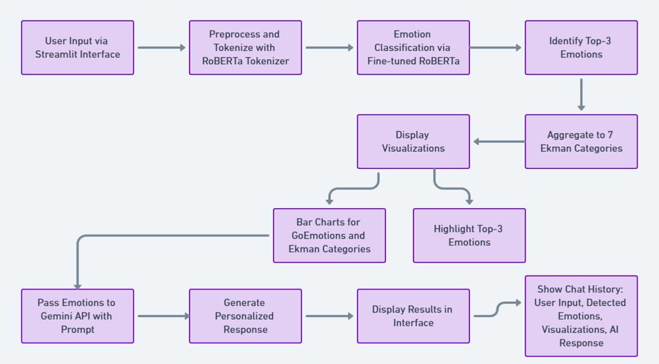

## Mental Health Chatbot using RoBERTa and Gemini

#### Repository Structure
```
Mental_Health_Chatbot/
├── model_weights.pth       # Pre-trained model weights
├── special_tokens_map.json # Tokenizer special tokens mapping
├── tokenizer/              # Tokenizer configurations and vocab
│   ├── tokenizer_config.json
│   ├── tokenizer.json
│   ├── vocab.json
├── app.py                  # Main application script (Streamlit)
├── README.md               # Project documentation
├── resources/              # Supporting documentation and images
│   ├── DL_Presentation.pdf
│   ├── BERT+LSTM.pdf
│   ├── RoBERTa.pdf
│   ├── chatbot_workflow.png # Workflow diagram
```

---

### Project Overview
This repository contains the implementation of a mental health chatbot designed to classify user emotions and provide solutions for emotional well-being. The chatbot leverages state-of-the-art NLP models, the GoEmotions dataset, and Gemini AI for response generation.

#### Key Features:
- **Emotion Detection**: Identifies 28 emotions using fine-tuned RoBERTa and Ekman mappings.
- **Solution-Oriented Responses**: Generates actionable mental health responses via Gemini API.
- **Interactive UI**: A user-friendly chatbot interface built using Streamlit.
- **Visualization**: Bar charts showcasing emotion probabilities.

---

### Model Selection and Architecture

#### RoBERTa (Robustly Optimized BERT Approach)
RoBERTa was chosen as the primary model due to its state-of-the-art performance in natural language understanding tasks. It provides robust contextual embeddings, making it suitable for nuanced emotion classification tasks.

**Key Features:**
- Fine-tuned on the GoEmotions dataset.
- Utilized a cosine learning rate scheduler to ensure stable and efficient training convergence.
- Employed binary cross-entropy loss for multi-label classification.
- Integrated dropout layers to prevent overfitting.

#### BERT + LSTM
This baseline model combines BERT embeddings with a bidirectional LSTM for sequential modeling. While not as effective as RoBERTa, it provides a computationally lighter alternative for emotion classification.

**Architecture Details:**
- BERT embeddings as input.
- A bidirectional LSTM layer for sequential processing.
- Dense layers with ReLU activation and dropout for regularization.
- Outputs probabilities for 28 emotion classes using a sigmoid activation function.

#### Comparison of Models
| Criteria                   | BERT + LSTM          | RoBERTa              |
|----------------------------|----------------------|----------------------|
| Macro F1-Score             | 0.15                | 0.74                |
| Weighted F1-Score          | 0.19                | 0.83                |
| Handling Class Imbalance   | Poor                | Good                |
| Multi-Label Capability     | Limited             | Optimized           |
| Training Stability         | Prone to instability| Stable              |

---

### Dataset
- **GoEmotions**: A dataset by Google containing 58k Reddit comments labeled with 28 fine-grained emotion categories, including joy, anger, sadness, and fear.
- **Emotion Mapping**: The model maps GoEmotions labels to Ekman’s six basic emotions (anger, disgust, fear, joy, sadness, surprise) for better interpretability.

#### Preprocessing Steps:
1. Tokenized comments using RoBERTa tokenizer.
2. Multi-hot encoding applied for multi-label classification.
3. Handled class imbalance using weighted loss functions.

---

### Model Training

#### Training Configuration:
- Optimizer: AdamW for efficient weight updates.
- Learning Rate Scheduler: Cosine annealing for smooth convergence.
- Batch Size: 32
- Epochs: 7

#### Training Insights:
- **RoBERTa:** Demonstrated strong performance with a macro F1-score of 0.74 and consistent precision-recall across classes.
- **BERT + LSTM:** Faced challenges in classifying rare emotions, with lower precision and recall.

#### Regularization Techniques:
- Dropout layers (rate: 0.3 for RoBERTa, 0.5 for BERT + LSTM) to minimize overfitting.
- Early stopping based on validation loss to prevent unnecessary training.

---

### Usage

1. Clone the repository:
```bash
git clone https://github.com/yourusername/Mental_Health_Chatbot.git
```

2. Install the dependencies:
```bash
pip install -r requirements.txt
```

3. Start the Streamlit app:
```bash
cd Mental_Health_Chatbot
streamlit run app.py
```

4. Enter a message in the chatbot UI to receive emotion detection results and mental health responses.

---

### Detailed Workflow

#### How the Chatbot Works:
1. **Input Handling**: The user enters a message in the Streamlit chatbot interface.
2. **Emotion Classification**:
   - The input text is tokenized using the RoBERTa tokenizer.
   - The model processes the tokenized input and outputs probabilities for each of the 28 emotion classes.
   - These probabilities are mapped to Ekman’s six basic emotions for better interpretability.
3. **Response Generation**:
   - The top-3 emotions (based on probability) are identified.
   - These emotions are sent as part of a prompt to the Gemini API, which generates an empathetic and actionable response tailored to the user’s emotional state.
4. **Visualization**:
   - Bar charts display probabilities for GoEmotions and Ekman emotions.
   - This visualization helps users understand their emotional state in a clear and actionable format.
5. **Interactive Chat History**:
   - Previous user inputs, detected emotions, and chatbot responses are displayed, allowing users to review their interactions.

#### Streamlit Features:
- **Dynamic UI Components**:
  - Text input box for user messages.
  - Persistent chat history displayed with detected emotions and responses.
  - Bar charts generated dynamically based on the model’s output.
- **Real-Time Analysis**:
  - Emotions are detected in real-time, and responses are generated without noticeable delay.
- **Error Handling**:
  - Streamlit’s error messages inform users if issues arise, such as connectivity problems with the Gemini API.

---

### Workflow Diagram


---

### Additional Details

#### Visualization:
- **Bar Charts:** Display probabilities of detected emotions (GoEmotions and Ekman mappings).
- **Top-3 Emotions:** Highlighted in the chatbot interface for actionable insights.

#### Integration with Gemini API:
- Leverages Gemini AI for generating empathetic responses based on detected emotions.
- Provides solutions tailored to user needs, ensuring actionable feedback.

---

### References
1. GoEmotions Dataset by Google
2. HuggingFace Transformers
3. Research papers on RoBERTa and BERT
4. Gemini AI documentation
